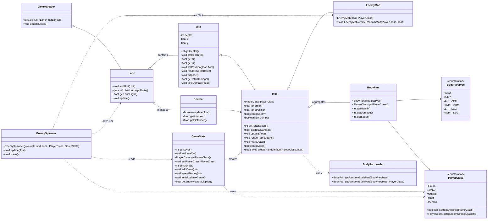

# Core Class Diagram

This diagram summarizes the main domain classes and relationships in the Core module. It focuses on entities that are central to gameplay, spawning, and combat.

Notes:
- Aggregation arrows indicate ownership or containment via collections.
- Dotted arrows indicate usage (reads/creates) without strong ownership.
