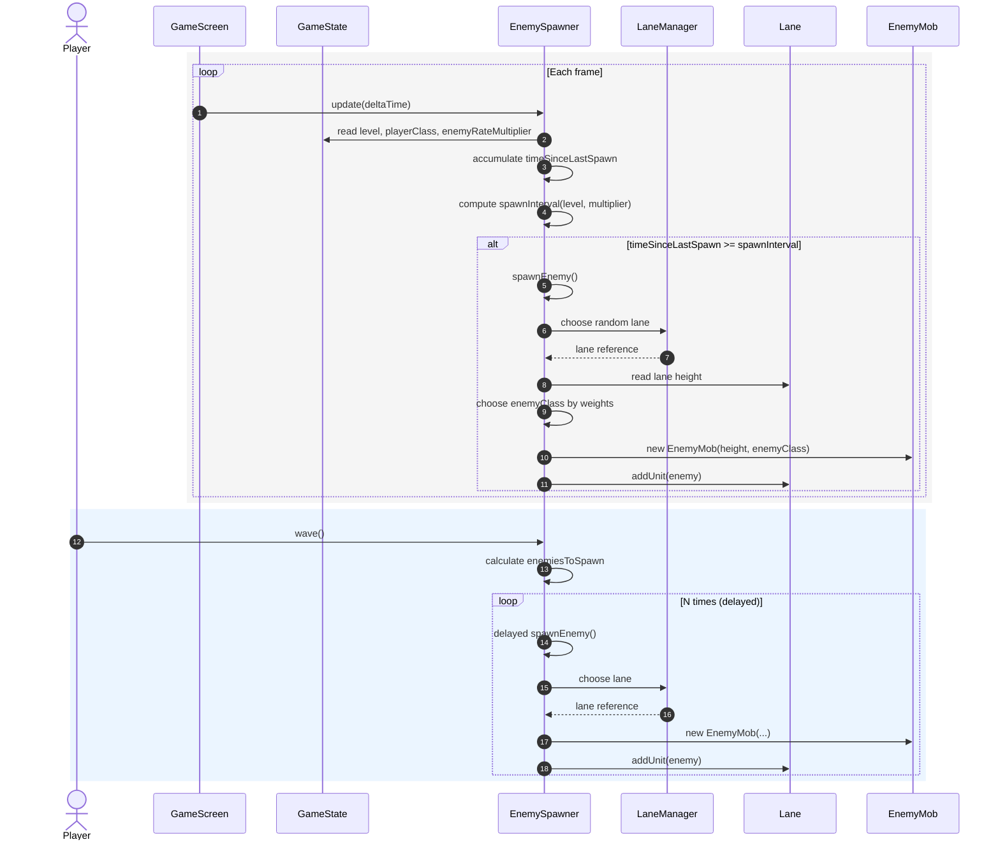

# Enemy Spawning Sequence Diagram

This diagram shows how enemies are spawned during the game loop and when a wave is triggered.

Notes:
- `spawnInterval` decreases with level and is scaled by `enemyRateMultiplier` from `GameState`.
- `wave()` spawns multiple enemies with short delays, distributing them across lanes.
